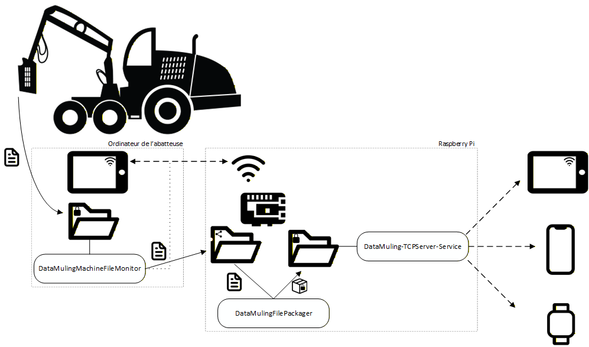

# FORAC - DataMuling

## Contexte

Les abatteuses forestières opèrent fréquemment dans des zones sans couverture réseau, limitant la transmission des données durant les opérations de récolte. Afin de répondre à ce problème, le centre de recherche FORAC a développé une solution de data muling permettant de transférer automatiquement les données de la tête d'abattage pendant les opérations de récolte. En tant que centre de recherche, nous avons développé et testé un prototype dans un contexte expérimental, mais nous n'avons pas les ressources pour déployer et maintenir cette solution chez des utilisateurs potentiels. Nous avons donc décidé de rendre ce projet accessible en code source ouvert, sous licence libre, afin d'en faciliter l'appropriation et l'utilisation par l'industrie.

## Description

Ce répertoire contient le code et les étapes de déploiement d'un prototype de data muling développé par le centre de recherche FORAC. Le répertoire contient plusieurs modules :
- RaspberryPi : Détail des étapes de déploiement d'un Raspberry Pi, qui est nécessaire pour automatiser le transfert de données sécurisé.
- DataMulingMachineFileMonitor : Contient le code du service Windows à installer sur l'ordinateur de l'abatteuse. Ce service établit et maintient une connexion au Raspberry Pi et assure le transfert de données vers celui-ci.
- DataMulingFilePackager : Contient le code de l'application à installer sur le Raspberry Pi qui, régulièrement, crée des paquets sécurisés à partir des fichiers transférés par le service DataMulingMachineFileMonitor.
- DataMuling-TCPServer-Service : Contient le code du service à installer sur le Raspberry Pi, qui roule un serveur TCP. Ce serveur permet à un appareil externe de communiquer avec le Raspberry Pi pour, entre autres, télécharger des paquets sécurisés.

## Fonctionnement

Un Raspberry Pi est configuré comme un point d'accès réseau et partage un dossier sur ce réseau. À mesure que l'abatteuse opère, des fichiers de données sont créés par le logiciel du manufacturier de la tête d'abattage. Ces fichiers sont déposés dans un dossier dans l'ordinateur de l'abatteuse. 

Le service DataMulingMachineFileMonitor maintient une connexion avec le Raspberry Pi, surveille le dossier où les fichiers de tête sont déposés et copie les fichiers périodiquement dans le dossier partagé sur le Raspberry Pi. 

Le DataMulingFilePackager est configuré pour être lancé toutes les 5 minutes. Il crée des paquets sécurisés à partir des fichiers dans le dossier partagé. Une fois un paquet créé, le fichier source est supprimé du dossier partagé et le paquet sécurisé est placé dans un dossier interne au Raspberry Pi.

Un appareil externe peut ensuite se connecter au réseau local créé par le Raspberry Pi et communiquer avec celui-ci pour télécharger les paquets sécurisés via une connexion TCP offerte par le service DataMuling-TCPServer-Service. Ce service permet aussi aux appareils externes de confirmer la réception des fichiers pour permettre un nettoyage des paquets transmis.

## Déploiement

Le déploiement de chaque module est détaillé dans les fichiers readme.md de leurs dossiers dans ce répertoire.